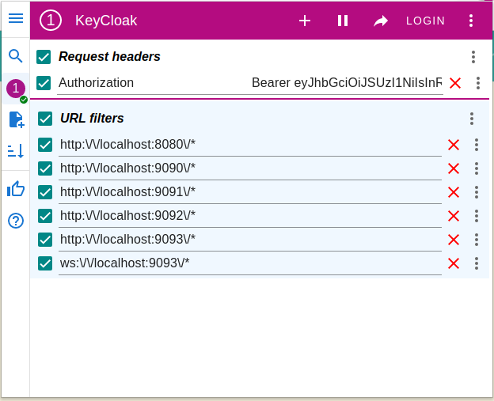

<!--
SPDX-FileCopyrightText: 2021 Alliander N.V.

SPDX-License-Identifier: Apache-2.0
-->

# Development for CoMPAS OpenSCD

## Building

If you want to build CoMPAS OpenSCD yourself in order to make some changes to your local installation or to contribute
to the project, you may first want to install [Node.js](https://nodejs.org/) in order to be able to use our local
development setup.

Once Node.js is installed on your system, you may get started by entering the following lines in your command prompt:

```
git clone https://github.com/com-pas/compas-open-scd
cd compas-open-scd
npm install
npm start
```

This will start a local development server and open a browser window which will automatically be reloaded as soon as you
save any changes to your local source code files.

## Linting & Formatting

If you use VSCode to develop, we recommend you install and use
the [ESLint](https://marketplace.visualstudio.com/items?itemName=dbaeumer.vscode-eslint)
and [Prettier](https://marketplace.visualstudio.com/items?itemName=esbenp.prettier-vscode) extensions in order to
automatically lint and format your code as you edit it. There are similar plugins available for
using [ESLint](https://eslint.org/) and [Prettier](https://prettier.io/) from within other IDEs and text editors.

## Scripts

We provide the following `npm` scripts for your convenience:

- `npm start` runs `CoMPAS OpenSCD` for development, reloading on file changes
- `npm test` runs the test suite with Karma
- `npm run lint` runs the linter (fixes problems in your code)
- `npm run format` runs the formatter (formats your code in a unified way)
- `npm run doc` builds HTML documentation into the `doc` directory
- `npm run build` builds a deployable version of the project into the `dist` directory

## Docker

It's also possible to run CoMPAS OpenSCD as a docker. Of every release a docker image is created and pushed to Docker
Hub. To run the docker container use the following command.

```
docker run -it --rm -d -p 8080:80 --name compas-open-scd lfenergy/compas-open-scd:latest
```

Now open a browser and go to "http://localhost:8080". CoMPAS OpenSCD is shown.

## CoMPAS Service

During development, it is sometimes handy to use running backend services, like CIM Mapping or SCL Data Service.
The problem is that these services need an Authorization Header to work. Normally these are injected by a reverse proxy
or something like that.

There is a work-around and that is using the ModHeader Extension of the Browser (Chrome, Firefox, ...).
With this extension the header 'Authorization' can be added with a value 'Bearer <access token>'.



URL Filters is used to only send this Request Header to the configured URLs.

To retrieve an Access Token from a running KeyCloak instance there is a Postman collection, see below.

### CoMPAS Services depends on a running KeyCloak instance

A KeyCloak instance needs to be running on port 8089 by default in dev mode. If a custom KeyCloak instance is used see
[Security](README.md#security) for more details.

There is a preconfigured Demo KeyCloak instance available for CoMPAS in the
[CoMPAS Deployment Repository](https://github.com/com-pas/compas-deployment). This repository can be cloned and
used to execute the following commands to create a local Docker Image with the CoMPAS Demo configuration.

```shell
cd <CoMPAS Deployment Repository Directory>/compas/keycloak
docker build -t compas_keycloak . 
```

A Docker Image `compas_keycloak` is created that can be started using the following command

```shell
docker run --rm --name compas_keycloak \
   -p 8089:8080 
   -d compas_keycloak:latest
```

There are now 3 users available to be used, `scl-data-editor`, `scl-data-reader`, `scd-reader`. See
[CoMPAS Deployment Repository](https://github.com/com-pas/compas-deployment) for more information about the users.

### Postman

To make a call to the CoMPAS Backend Service work in CoMPAS OpenSCD we need to import an environment and authorisation 
collection. These files can be found in [CoMPAS Deployment Repository](https://github.com/com-pas/compas-deployment) 
in the directory `postman` (`auth.collection.json` and `local.environment.json`).

In the authorisation collection there are called for the 3 users known within the Demo KeyCloak instance.
If one of these calls are executed you can switch to the tab `Visualize`. There is a button to copy the bearer to the 
clipboard. This will also be done automatically when switching to the tab (label becomes `Copied!`).
The value of the clipboard can be copied in ModHeader Extension as Authorization Header. 

Hint: `Bearer` is included in the value of the clipboard, so the complete value in ModHeader can be replaced.
